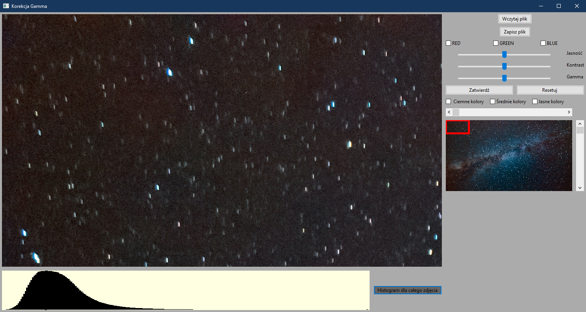

# Image corrections app
> We are presenting a simple application that can be used for precise adjustment of brightness, contrast and gamma of your image.

## Table of Contents
* [General Info](#general-information)
* [Technologies Used](#technologies-used)
* [Features](#features)
* [Screenshots](#screenshots)

## General Information
This application is our final project for the Computer Graphics course. The objective of this program was to develop a program that allows for precise adjustment of gamma correction, 
brightness and contrast of an image. The program provides real-time feedback, allowing continuous observation of the results of your adjustments.

## Technologies Used
- ISO C++14 standard
- wxWidgets 3.2.2.1
- FreeImage 3.18.0

## Features
- Loading/Saving JPEG and PNG images
- Accurate adjustments of gamma correction, brightness and contrast for a selected image region
- Ability to make adjustments for the RGB channels collectively as well as individually
- Ability to make adjustments for bright, medium and dark colors
- Real-time observation of the results
- Histogram of both the selected region and the entire image

If you want an explanation of how we implemented the above features - click here -> [Documentation](./Documentation.md)

## Screenshots

